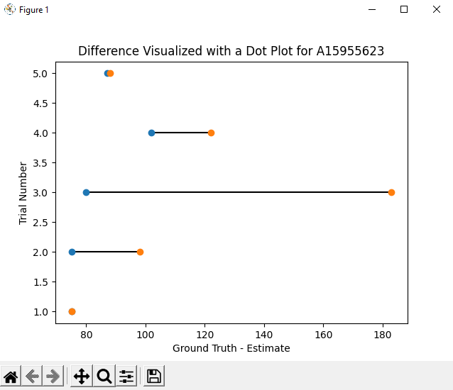

Haozhang (Jim) Chu A16484292

# README

## Objective:
The goal of this lab is to let student learn the process of machine learning. In the lab, students are able to learn how
to prepare data for machine learning, the general process of training data, the different training method and 
verification method we can use. Then, students are asked to put the machine learning model to good use by incorporating
the machine learning model to the HRMonitor class to help us better predict heart rate. Lastly, students are asked to 
build a complete wearable which include many previously developed smartwatch feature. Students are able to practice 
their State Machine, Arduino, Python, and merging skills.

## Tutorial 1: ML Data Preparation
### Task Descriptions:
In tutorial 1, we learn how to read in data files with the same naming convention with glob, processing these data, 
verify the quality of the data visually, estimating the sample rate at which the data is recorded. First, I downloaded
all classmate and my data from Google Drive and placed it in the data folder. Second, we are introduced to glob and seen
the power of * at the end of the file path. It will retrieve any file or folders it finds. Third, we wrote get_subjects()
to retrieve a list of name of subjects, get_hr() which estimate heart rate from user reported peak count, estimate_fs()
which estimate the sampling rate at the sampling time from the data, and get_data() which retrieves a data file, get the
heart rate and verify the sampling frequency is reasonable.

Lastly, with the code organized together, I looked through all the downloaded data, by observing the plot of raw ppg
data plot and the filtered data plot. I also paid attention to the estimated sampling rate. When encountered bad data,
I deleted them to ensure all the data for later machine learning are good data.

>Note: On Windows machines \\ need to be used in the file path instead of /

## Tutorial 2: GMM HR Monitor
### Task Descriptions:
In tutorial 2, we are introduced Gaussian Mixture Training, which is the machine learning way to determine the threshold
to distinguish a heart beat event from a non heart beat event. First, we are asked to practice leave-one-subject-out-
validation. We first pip install scikit-learn. Second, we are introduce the .fit() train the GMM and .predict() predict
the labels function. We trained and tested on the same data from 5 trials of the a083884563 subject and plotted the 
prediction overlaid with the signal. Then, we plotted the histogram Gaussian Distribution and observed that the model is
fitting our data well. Since our data is now labeled as 0s and 1s, in order to detect a heart beat, we detect the
transition of a 0 to 1. We can use the np.diff() function and find the number of 1 in the computed diff. Then we plotted
the detected peaks overlaid with the signal. Lastly, we practiced leave-one-subject-out validation of all of our 
training data and checked through how our algorithm performed at estimating heart rate.

## Challenge 1: GMM Performance

### Model Evaluation:
#### Correlation Plot, Bland-Altman Plot, Root Mean Squared Error:

By looking at the correlation plot, it can be observed that this model isn't doing very well with a correlation
coefficient of 0.52 which is relatively low and a RMSE of 30.781683 which is relatively high error. However, by 
observing the graph we can also see that most of the data points are closely following the trend line, however there 
are about ten data points that are very off from the trend line which lead to such a decrease in the correlation 
coefficient. This fact can be observed better by viewing the Bland-Altman plot, we can clearly observe that most of the
data are within 2 standard deviation away from the mean, actually even better, most of them are even closer than 2 
standard deviation away from the mean. There are, however, some data (less than 10 data points) that are much less than
the lower bound, not only dragging down the mean, but also increases the error in our model.

#### Per Subject Difference Evaluation:
It can be observed from the correlation and Bland-Altman plot above that some data are worse than others. The prediction
for these data could be doubled the ground truth heart rate. In order to see which data are causing our model trouble,
we decided to plot the difference between the predicted heart rate and the ground truth heart rate for each subject.
Below are some examples of good data, bad data, and edge data.

Good Data #1                                    |               Good Data #2                      |          Good Data #3 
:----------------------------------------------:|:-----------------------------------------------:|:-----------:
 |  | 

It can be observed that the difference between predicted heart rate and ground truth heart rate are minimal for good
data.

Bad Data #1                                     |                Bad Data #2                      |          Bad Data #3 
:----------------------------------------------:|:-----------------------------------------------:|:-----------:
 |  | 

It can be observed that the difference between predicted heart rate and ground truth heart rate are extremely large for
bad data. It can be concluded that these data are throwing our model off, thus they are be discard.

Edge Data #1                                    |                  Edge Data #2                   |          Edge Data #3 
:----------------------------------------------:|:-----------------------------------------------:|:-----------:
 |  | 

It can be observed that for these edge data, some trails have minimal difference between predicted heart rate and
ground truth, some trails have some decent difference between predicted heart rate and ground truth.

#### Results of Discarding Some Data:

We decided that for any data with a prediction heart rate and ground truth heart rate difference of more than 20 beats
per minute, we are going to discard them without any sympathy. (Poor data...) After this, we plotted the Correlation
plot and the Bland-Altman plot again. It can be observed now, that our data is following the trend much nicer in the 
Correlation plot, with a much higher correlation coefficient of 0.93 and a significantly reduced RMSE of 4.974702 which
is relatively low. By comparing the current Bland-Altman plot from the previous one, we can see that our standard 
deviation in the current plot has significantly dropped. However, most of the data is still within 2 standard deviation 
away from the mean. It can be concluded that the model is better now with the correlation plot and Bland-Altman plot.

### Task Descriptions:
In challenge 1, we try to evaluate the performance of the previous machine learning model which used Gaussian Mixture
Model. In order to evaluate the performance, we objectively access the model and looks at where is fails to accurately
predict the label. We plan to plot the correlation plot and the correlation coefficient relative to the prediction and 
ground truth for our data. We also plan to plot the Bland-Altman plot to observe how many stand deviation away are our
prediction usually off from the ground truth. Furthermore, we are going to compute the root mean squared error between
our prediction and the ground truth and use this as the numerical evaluation for our Gaussian Mixture Model. Lastly, 
besides all these plot which will provide us with lots of useful insights on the performance of our model, we will also
visually observe the difference between the ground truth and the prediction upon testing from the data quality
perspective. After identifying the bad data, we got rid of them and trained a better model and plotted the correlation
plot and the Bland-Altman plot.

## Challenge 2: GMM HR Monitor
### YouTube Video Links:
Here is the video showcasing the program with a slightly elevated heart rate: https://youtu.be/5WKDBYbydfc

Here is a video with a more rested heart rate: https://youtube.com/shorts/ch0Yo5p_ECA?feature=share

### Improving on the Model & Processing:
In the previous challenge, we discarded any data that have a predicted heart rate and ground truth heart rate difference
of more than 20 beats per minute. In this challenge, we are discarding data that have a predicted heart rate and ground
truth heart rate difference of more than 10 beats per minute, so our model has a better correlation and RMSE.

In addition, instead of using the simple demonstration processing as in the previous challenge to evaluate the performance
of the model. We decided to use the more sophisticated signal processing of HRMonitor built in the previous lab to 
improve performance. Therefore, before the data goes into GMM, it will go through the signal processing built in the
previous lab.

### Task Descriptions:
In this challenge, we are asked to add the machine learning model that we developed into the HRMonitor class, so the 
HRMonitor class can use this model to estimate heartrate, instead of using a hard threshold. In order to do this, we
modified HRMonitor class, and wrote two methods within. The train() method which trains the model from data, and the 
predict() method which produces an estimated heart rate. Both of these method are private method within the HRMonitor
class. The keyword @staticmethod was used.

In order to take care of poor quality or inadequate data, a couple of try-except clauses are used to hand these 
situations. In most cases, bad data will cause ValueError which will cause the program to crash (terminate). By using
try-except clauses, we can let our program continue to run even after bad data. When encountering bad data or no finger
is placed on the Photodetector, the command "-1" will be displayed on the OLED display. This feature is demonstrated in
the recorded video.

## Challenge 3: Complete Wearable
### YouTube Video Link:
v1: https://youtu.be/jCX08KPpZVE

v2: https://youtu.be/UhR2pMChgsc

### Google Drive Link:
https://drive.google.com/drive/folders/1t-VrWbE1R1XuhaZbmVZhG3NSt5TG1QP7

### State Space Diagram:

### Mode Features:
Pedometer mode counts the step taken by the user. It has an internal upper threshold, so only small and frequency shakes
of the board can be used to simulate steps. The Pedometer updates the counted step counts to the OLED display.

Heartrate Monitor mode can show the current heart rate of the user once they place their fingers on the Photodetector. 
When no finger is on the Photodetector, the heart rate shown will be 0. The Heart rate monitor needs a couple seconds of
heart beat data to stabilize and output the correct heart rate, after the finger is taken away, it will take a couple
seconds for the previous data to go out of the buffer and output a heart rate of 0.

Weather Watch mode will display the current time on the first line of the OLED, the date on the second line of the OLED,
the current weather of San Diego on the third line of the OLED, and lastly the location San Diego on the fourth line of 
the OLED.

Idle Detector mode will show "Great Job" and ON message on the display if there is motion detected in the past second.
(nothing if it is shorter than a second, as shown in the first attempt in the video which happened to be shorter than
a second). If there is idleness for 5s, the LED will start to blink and OLED will display "Idle 5s". After another 5s of
idleness, the buzzer will buzz for 1s and OLED will display "Idle 10s". If a motion is detected, the Idle Detector will
return to state 30, the active state. No matter which state the Idle Detector is currently at, pressing button2 will
toggle the Idle Detector ON and OFF, and pressing button1 will lead it to move on to Pedometer mode.

### Task Descriptions:
In Challenge 3, we are asked to build a complete wearable including feature such as Pedometer, Heart Rate Monitor, Idle
Detector, and Weather Watch as done in previous labs. For the hardware aspect of this complete wearable, it is using 
OLED, buzzer motor, accelerometer, photodetector, and two buttons. On the software aspect, it is using all modules in
the ECE16Lib, such as CircularList, Communication, DSP, HRMonitor, IdleDetector, and Pedometer.

On the Arduino side, it receives a comma separated complete command from Python (Example: step count, Heartrate, time, 
date, weather, location, command), and the MCU parse that command into sub commands. Depending on the command, the MCU 
could start to collect and send data to Python for processing. The MCU also have an internal state variable to represent
the current state of the Complete Wearable as drawn on the State Diagram above. Button1 is used for Mode transition, 
such as from Pedometer to Heart Rate Monitor, from Heart Rate Monitor to Idle Detector, and lastly from Idle Detector 
back to Pedometer. Button2 is used for internal transitions in the Idle Detector to turn it ON and OFF. Other transitions
are labeled as the state diagram attached above.

On the Python side, it receives a comma separate complete message from the MCU (Example: time, ax, ay, az, ppg), and 
Python parse that message and use it for processing step count, heart rate, and idleness. During these processes, DSP,
Pedometer, HRMonitor, and IdleDetector are used. After processing the data sent by Arduino, the Python program sends the
complete command in the format Arduino expects to the MCU. Thus forming a functional complete wearable.